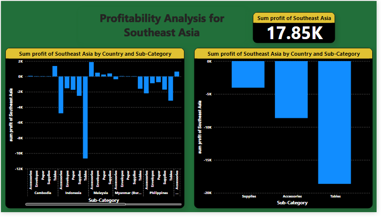

# Global Superstore

## INTRODUCTION
This is a Power BI project on sales analysis of a Survey of a Superstore called **Global Superstore**. 
This project is to analysis and derive insights to answer crucial questions and help the store make a data driven decisions.

## PROBLEM STATEMENT
- 	What are the three countries that generated the highest total profit for Global Superstore in 2014? b) For each of these three countries, find the three products with the highest total profit. Specifically, what are the products’ names and the total profit for each product?
- 	Identify the 3 subcategories with the highest average shipping cost in the United States
- 	Assess Nigeria’s profitability (i.e., total profit) for 2014. How does it compare to other African countries? b) What factors might be responsible for Nigeria’s poor performance? You might want to investigate shipping costs and the average discount as potential root causes.
- 	) Identify the product subcategory that is the least profitable in Southeast Asia. Note: For this question, assume that Southeast Asia comprises Cambodia, Indonesia, Malaysia, Myanmar (Burma), the Philippines, Singapore, Thailand, and Vietnam. b) Is there a specific country i n Southeast Asia where Global Superstore should stop offering the subcategory identified in 4a?
- 	Which city is the least profitable (in terms of average profit) in the United States? For this analysis, discard the cities with less than 10 Orders. b) Why is this city’s average profit so low?
- 	Which product subcategory has the highest average profit in Australia?
- 	Who are the most valuable customers and what do they purchase?

## SKILLS DEMONSTRATION
- 	Power Query
- 	Data Modeling 
- 	Data Cleaning 
- 	Data Visualization
- 	Creating new column and new measures
- 	Knowledge of generating actionable insights Etc.

## DATA SOURCING
Not until I came up with the above questions did, I went ahead to get the data. Ithen downloaded the csv file and extracted into Power BI for cleaning, analysis and visualization.
It contains 3 sheets/tables:
1.	ORDERS with 51,290 rows, and 24 columns
2.	PEOPLE with 13 rows, and 2 columns
3.	RETURNS with 1,173 rows, 3 columns

## DATA TRANSFORMATION/CLEANING
Data was efficiently cleaned and transformed with the Power Query Editor of Power BI. [a screenshot of the applied steps] Some of the applied steps included
- 	Making first row as header in the PEOPLE and RETURN tables
- 	Analytical transformation of the ‘order tables. To have an idea of the profitability and performance of different country in different region
- 	Create new column for year order date and named: ‘Order Year’.
- 	Datatype then changed from **TEXT TO WHOLE NUMBER**.

## DATA MODELLING
Power BI automatically connected related tables resulting in a Entity -relationship model. The ‘Order’ table is the fact table of the model. The remaining two-dimension tables ‘Returns’ table and ‘People’ are connected to the ‘Order’ table via common columns, ‘Order ID’ and Region respectively.

## DATA VISUALS AND ANALYSIS

From the dashboard we will observe the following;
- 	The three countries that generated the highest total profit for Global Superstore in 2014
- 	 For each of these three countries, you will find the three products with the highest total profit and the products’ names and the total profit for each product 2014 are; For United States
1.	Canon image CLASS 2200 Advance Copier, Total Profit is 15,679.96
2.	GBC DocuBind TL300 Electric Binding System, Total Profit is 1,910.59
3.	Hewlett Packard LaserJet 3310 Copier, Total Profit is 3,623.94
       For China;
1.	Bush Classic Bookcase, Mobile, Total Profit is 1,220.52
2.	HP Copy Machine, Color, Total Profit is 1,196.13
3.	Sauder Classic Bookcase, Metal, Total Profit is 1,463.07
      For India;
1.	Cisco Smart Phone, with Caller ID, Total Profit is 1,609.38
2.	Hamilton Beach Refrigerator, Red, Total Profit is 1,440.24
3.	Sauder Classic Bookcase, Traditional, Total Profit is 2,419.65.

- 	This shows the 3 subcategories with the highest average shipping cost in the United States.
- 	 Nigeria’s profitability (i.e., total profit) for 2014 is actually low and on a negative side compare to other African countries.
- 	The factors that might be responsible for Nigeria’s poor performance is that the shipping costs is on the high side and the average discount is on the high side as well which is a potential root cause.

From the dashboard you will observe that;
- 	The least product subcategory profitability in Southeast Asia.
- 	And you will notice the least product subcategory that is not profitable in Philippines is ‘Tables’.
- 	From The countries in Southeast Asia where Global Superstore should stop offering the subcategory is the Philippines.

- 	This Identifies the city with the least profitability (in terms of average profit) in the United States which is Lancaster, and the average profit is low because of low Orders.
- 	The product subcategory has the highest average profit in Australia is Appliances

This dashboard shows the most valuable customers and the different products they purchased.

## RECONMENDATION/ CONCLUSION.
By leveraging data analytics, Global Superstore can significantly enhance its decision-making process, leading to improved performance and profitability. The key insights drawn from the data highlight the importance of focusing on high-value product categories, optimizing regional strategies, and enhancing customer engagement. Operational improvements and data-driven strategies will further support sustainable growth. Implementing these recommendations will help Global Superstore strengthen its market position and better serve its diverse global clientele. 

